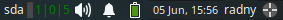
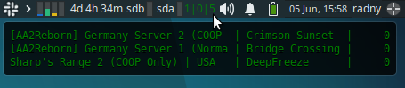
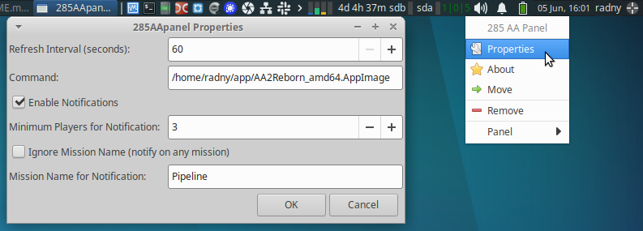

# 285AApanel

Simple XFCE4 panel plugin that shows game server statistics: Online | In-Game | Servers.

Screenshots:







Quick install for non-advanced Linux users:

1) If you have a prebuilt `.deb` (easiest):

```bash
# download the .deb (e.g. from Releases) and install:
sudo dpkg -i 285AApanel_1.0_amd64.deb
sudo apt-get install -f    # fix dependencies if needed
```

2) To build and install locally:

```bash
sudo apt install libxfce4panel-2.0-dev libgtk-3-dev libcurl4-openssl-dev libnotify-dev libjson-glib-dev
make
dpkg-deb -b deb 285AApanel_1.0_amd64.deb
sudo dpkg -i 285AApanel_1.0_amd64.deb
```

Usage:
- Add the plugin via Panel Preferences > Items > Add.
- If the plugin doesn't appear, restart the panel: `xfce4-panel -r`

Uninstall:

```bash
sudo dpkg -r 285aapanel
```

For full developer documentation and detailed instructions see `README-DEV.md`.

